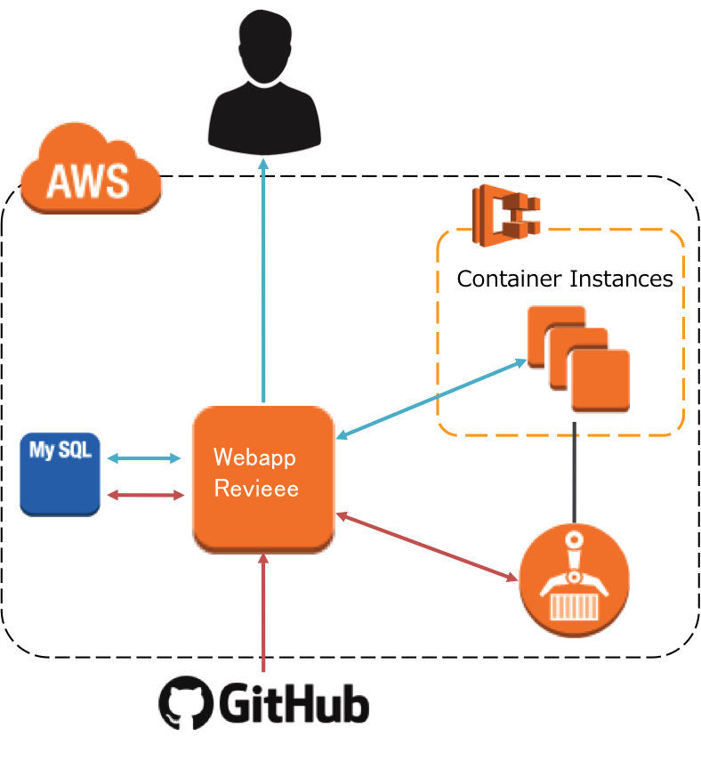
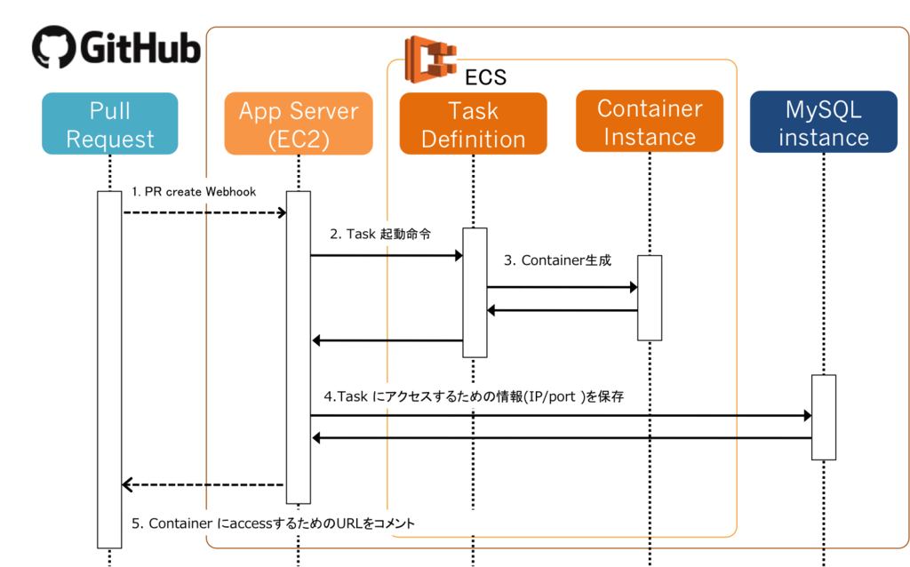

# Webapp Revieee

GitHubのPull Request毎に確認環境を自動構築するツール

- Pull Requestを作成すると確認環境を構築
- Pull RequestをCloseすると確認環境を削除
- Pull Requestに新しい変更があると確認環境を更新

# 構成

## 全体構成図

## コンテナのデプロイ

1. App ServerがGitHubからPull Request Openのwebhookを受取る
2. Pull RequestのHEAD Branchの確認環境をECSに起動する
3. ECSに起動された確認環境へのアクセス情報をMySQLに保存する
4. 確認環境にアクセスするためのURLをGitHubの該当Pull Requestにコメントする

## 確認環境へのアクセス

1. 確認環境のURLにアクセスする
2. NginxはURLに該当するECSの確認環境へのアクセス情報をMySQLから取得してproxyする

# 導入方法

## Webapp Revieeeを構築する

TODO

## Webapp Revieeeを導入したいリポジトリを設定する

TODO

# Reporting Bugs and Contributing Code

Want to report a bug or request a feature? Please open an issue.
Want to help us? Fork the project, and make a pull request. We need all the help we can get!
